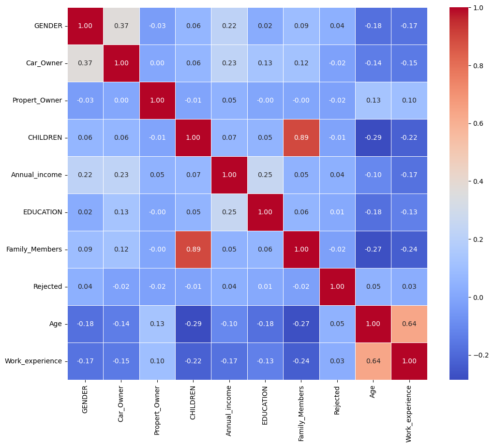
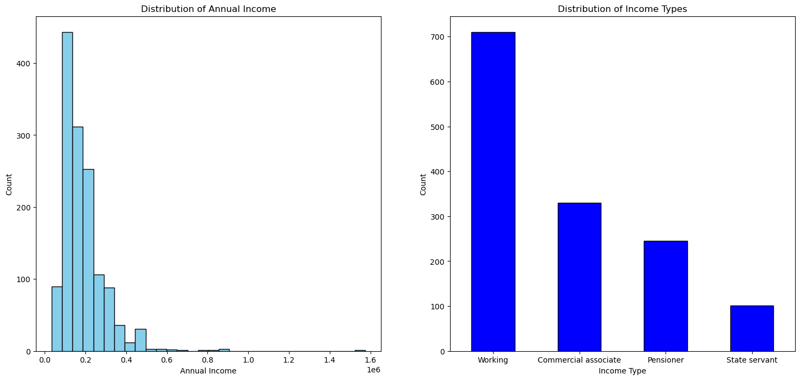
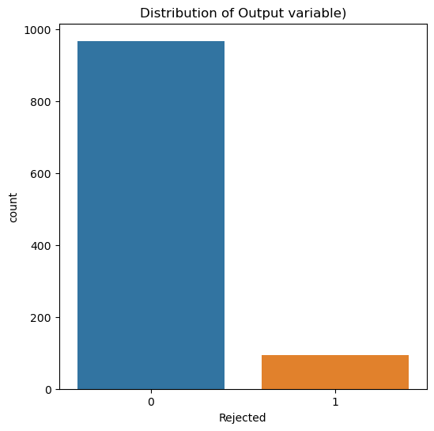

# credit-card-binary-classification

## Introduction
The credit card approval process plays a significant role in determining the financial well-being of individuals. The ability to predict the approval or the rejection of credit card applications is crucial for financial organizations to manage risk effectively and make decisions based on that. In this report, we are using various machine learning models to analyze the customer's data and automate the process of binary classification to predict the possibility of customers' attributes to get their applications approved or rejected.

## Analysis of the dataset
The credit card applicants' datasets for approval of the application on binary classification problem The dataset consists of 15 features, namely, ID, Gender, Car Owner, Property Owner, Number of childern, Annual Income, Type of Income, Education Level, Marital Status, Housing Type, Birthday Count, Employed Days, Type of Occupation, Family Members, Rejected Applications. The dataset consists of over 1500 observations and consists of various data types such as integer to object datatype.

Before diving into the Exploratory Data Analysis (EDA), we need to make sure the dataset is understandable and well-organized, preparing it is necessary before beginning the Exploratory Data Analysis (EDA). This includes fixing mistakes, dealing with missing data, eliminating anomalies, and carrying out any required adjustments. The primary tasks carried out during the preprocessing phase are as follows:

1. Handling Missing Values: Initially, we need to identify the missing values. For attributes - Annual Income and Age, we filled the null values with the mean of each attribute respectively.
2. Handling Duplicate Values: Redundant data in the dataset hinders maintaining data integrity. The duplicate data in the dataset has been removed to eliminate the possibility of inaccurate results.
3. Treating Anomalies: Anomaly detection and treating anomalies is essential for any dataset since it can skew the distribution heavily if not treated right.
4. Binary Encoding: For categorical data, we map each categorical value with its binary equivalent. For attributes, Property Owner, Car Owner, and Gender where the values are either Yes or No, or Male and Female. We have mapped each value as 0s and 1s.
5. Converting relevant values into meaningful values: Since the dataset consisted of negative values for birthday count (in days) and employed days (in days), the data has been converted to a more meaningful format by converting them into Age (in years) and Work Experience (in years).

The correlation matrix heatmap provides a visual representation of the relationships of each variable with each other. In this correlation matrix, there is a significant positive correlation between variables - Gender and Car Owner, Age and Work Experience, Education and Annual Income.

Distribution of Annual Income and Types of Income

Distribution of output variables

Since there is a significant difference between the X and Y data frames as shown in the figure below. We will use a method called SMOTE (Synthetic Minority Oversampling Technique). SMOTE overcomes the imbalance problem in the dataset. Instead of adding redundant samples, SMOTE creates synthetic data samples for the minority class and aims to balance the class distribution.
SMOTE Algorithm:

1. Input Parameters: _X_ being Feature Matrix, _Y_ being Minority Class, _k_ is the number of neighbours and _oversample_ratio_ is the ratio  of oversampling.
2. Separate the Minority and Majority Classes: Identify these samples by _minority (Y = 1)_ and _majority (Y = 0)_
3. Calculating Samples and Randomly Selecting Minority Samples: Determining the number of synthetic samples that need to be generated and randomly selecting samples for generating samples
4. Calculating Euclidean Distance: Between the selected minority samples calculate the Euclidean distance.

$$  EuclideanDistance_{ij} = || minoritySample_i -  minorityClass_j ||_2 $$

5. Generate Synthetic Samples: For each minority sample that was selected, we take a random neighbor and generate synthetic samples by adding randomness ($\alpha$) in the sample.

$$ SyntheticSample = MinoritySample + \alpha × (Neighbor - MinoritySample) $$

6. Combining Samples: Combine the synthetically generated samples with original minority and majority samples.

## Model Selection and Implementation

Before we start selecting the machine learning model and implementing we need to split the data into training and testing data. For splitting, we are using Hold Method which splits the data into two sets - training and testing sets. In this dataset, we are dividing 80\% of the data to the training set and the remaining 20\% of the data to the testing set. 

Our goal is to select a binary classification model for credit card approval prediction, the best candidates for binary classifiers are mainly Random Forest Classifier, K-Nearest Neighbour Classifier, Logistic Regression, and Decision Tree. We are going to implement a Random Forest Classifier, K-Nearest Neighbour Classifier, and Logistic Regression.

__Random Forest Classifier:__ Random Forest Classifier enhances robustness by combining the output of multiple decision trees to reach a single result. Random Forest Classifier uses an ensemble learning technique which simply means combining Bagging and Boosting Models. The use of bootstrapping and voting systems helps the model reduce the overfitting problem. This model consists of 2 classes DecisionTree and RandomForest

Explaining class DecisionTree:
1. Initialization: The _DecisionTree_ class is initialized with a specific _max_dept_
2. DecisionTree fit: Set the leaf node value if the node has just one class or if the depth limit has been reached. Determine the Gini impurity for each split scenario that the dataset may have.
3. Calculating Gini Impurity: Based on class labels in the left and right partitions, calculate the Gini impurity for a split.

$$
            Gini = 1 - \sum_c (\frac{count(c)}{total size})
$$

4. DecisionTree Predict: Return the value of the node if it is a leaf. Traverse the left subtree if the sample's feature value is less than or equal to the threshold; if not, go through the right subtree.

Explaining class RandomForest:
1. Initialization: The _RandomForest_ class is initialized with the number of decision trees (estimators) and the maximum depth of the decision trees.
2. RandomForest fit: Bootstrapping samples and fitting them with the DecisionTree class allows you to generate decision trees iteratively. Combine all of the decision trees in the list of estimators.
3. RandomForest predict: Using predicted outcomes from each decision tree, make predictions. The class with the majority vote will be elected.

__K-Nearest Neighbour Classifier:__ Being one of the simplest nonparametric classifiers. During the training phase, As a reference, the whole training dataset is stored by the KNN algorithm. It determines the distance, using a selected distance metric like Euclidean distance, between each training sample and the input data point before generating predictions. The projected label for the input data point is determined by the algorithm by taking the class label that is most prevalent among the K neighbors.

Explaining class KNNClassifier:
1. Initialization: Takes the number of neighbors as _k_ input and initializes with the KNN Classifier.
2. Training: Takes _X_train_ and corresponding labels _y_train_ as input and storing them.
3. Prediction: Takes test dataset as input. For each sample in the test dataset, we calculate the Euclidean distance.

$$ EuclideanDistance = \sqrt{\sum_{i = 1}^{n} (X_{test, i} - X_{train, i})^2} $$

where _n_ is number of features

* Find the indices of the _k_ samples in _X_train_ with the smallest distances:

$$
nearestNeighborsIndices = argsort(distances)\[:k\]
$$

* Get the labels that go with the closest neighbors:

$$ nearestLabels = y_{train}[nearestNeighborsIndices] $$

* item Based on the majority class among the closest neighbors, determine the label for the _X_test_.

$$ predictedLabel = argmax(bincount(nearestLabels)) $$

* Add the predicted label to the list of predictions.

4. Returns the array of predictions.

__Logistic Regression:__
Explaining Logistic Regression:

1. Initialization: Takes input as Learning rate ($\alpha$), number of iterations, regularization parameter ($\lambda$) and finally initialize with weights _(w)_ and bias _(b)_ as zeros.

2. Sigmoid function: This function helps in mapping the linear output to a range between 0 and 1. 

$$ \sigma(z) = \frac{1}{1 + e^{-z}} $$ 

where _z_ is the linear combination of weights and features:

$$ z = w . X + b $$

3. Cost function: The negative log-likelihood represents the logistic regression cost function.

$$ J(w, b) = - \frac{1}{m} \sum_{i = 1}^{m} [y^{i} log(\sigma(w . X^{i} + b )) + (1 - y^{i}) log (1 - \sigma(w . X^{i} + b))] + \frac{\lambda}{2m}  \sum_{j = 1}^{n} w_{j}^{2} $$

where m is the number of samples, _n_ is the number of features, Xi is the feature vector for the ith sample, yi is the true label for the ith sample. 
    
4. Gradient Descent: The gradients are computed as follows concerning the weights _(w)_ and bias _(b)_:

5. Training: Reiterate and update the weights and bias using gradient descent and repeat this process for the specified number of iterations.
6. Prediction: If the probability is more than or equal to 0.5, categorize the sample as positive; if not, label it as negative.

$$    Probability (Positive) = \sigma (w . X_{test} + b) $$

Using the sigmoid function as a basis for prediction, this technique determines the weights and bias that minimize the logistic regression cost function. Overfitting is avoided by using regularization.

## Evaluating the Metrics

| Random Forest Classifier         | KNN Classifier | Logistic Regression |
|:------------:|:-----:|:----------:|
| 89% |  87.26% |   89.62%  |

The accuracy of the Random Forest Classifier, KNN Classifier, and Logistic Regression is very close to each other so it is hard to determine the best candidate for the model. However, there are some underlying concepts, traits, and specific characteristics of the objective, the dataset, and the target variables.

Some of the traits of Random Forest Classifiers are Feature Importance, and Handling Non-Linearity. KNN Classifier excels in a simplistic straightforward approach while Logistics Regression excels in interpretability and efficiency.

Since Random Forest Classifiers provide aggregated predictions from multiple trees. It also provides a reduction of bias and variance by capturing complex relationships. Most importantly, Random Forest Classifiers provide a Feature Importance score, helping you determine which characteristics most significantly affect the model's predictions. This data is useful for selecting features and comprehending the dataset.

We obtained satisfactory accuracy rates by using three different machine learning models: Random Forest Classifier, K-Nearest Neighbour Classifier, and Logistic Regression. Even while the models performed similarly, the Random Forest Classifier was the better option because of its ability to learn in groups, insights into the significance of features, and skill in managing non-linear interactions. Class imbalance concerns were addressed by preprocessing techniques such as the Synthetic Minority Oversampling Technique (SMOTE).